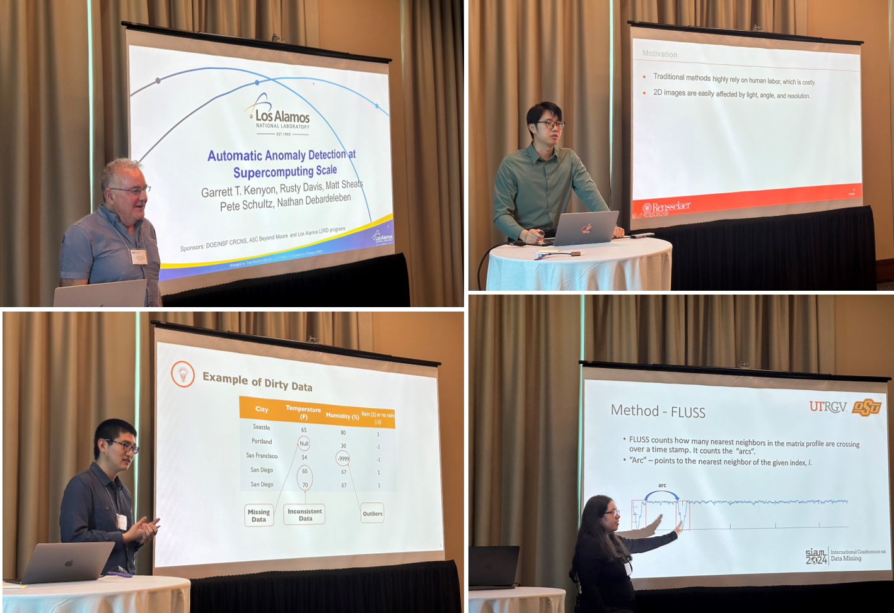
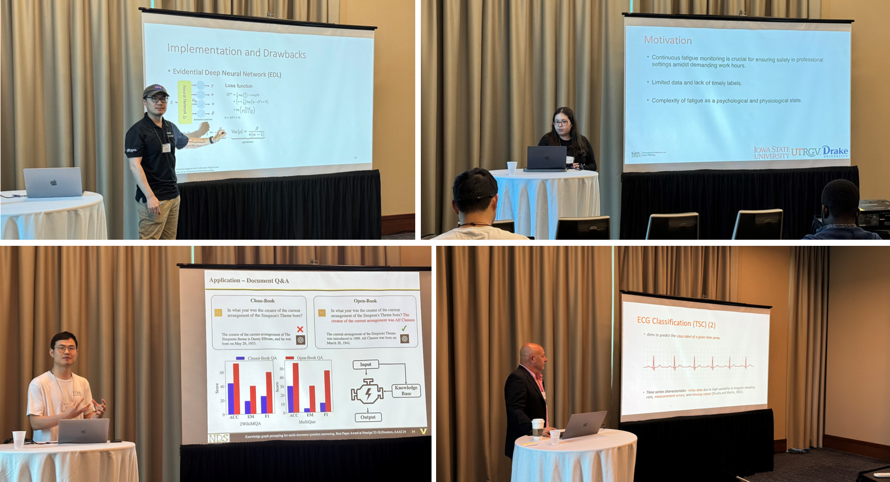
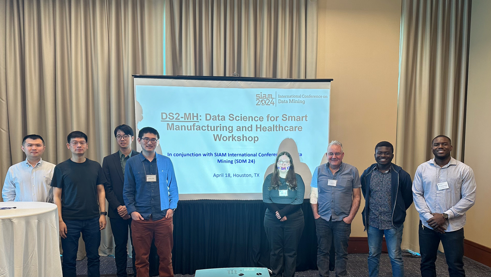

## Full Contact Information of Organizers
* **[Jihoon Chung](https://cjh7.github.io/)**, Assistant Professor, Pusan National University, Korea, [jhchung@pusan.ac.kr](mailto:jhchung7@pusan.ac.kr)

* **[Chenang Liu](https://stars-laboratory.github.io/)**, Assistant Professor, Oklahoma State University, [chenang.liu@okstate.edu](mailto:chenang.liu@okstate.edu)

* **[Yao Ma](https://yaoma24.github.io/)** Assistant Professor, Rensselaer Polytechnic Institute, [may13@rpi.edu](mailto:may13@rpi.edu)

* **[Diane Oyen](https://public.lanl.gov/doyen/)**, Scientist and Team Leader of Machine Learning, Los Alamos National Laboratory, [doyen@lanl.gov](mailto:doyen@lanl.gov)

* **[Yinan Wang](https://yinanw-rpi.com/)** Assistant Professor, Rensselaer Polytechnic Institute, [wangy88@rpi.edu](mailto:wangy88@rpi.edu)

## Workshop Description

In the era of the Internet of Things (IoT), with the rapid development of advanced sensing, data storage, data analytics, and high-performance computing technologies, both manufacturing industries and healthcare systems are experiencing a data‑driven revolution. However, the unique characteristics of manufacturing and healthcare systems prevent the direct application of existing data-driven methods. Their characteristics include (1) systematic physical principles, (2) high demand for interpretability, robustness, and trustworthiness, and (3) limited computation resources and the need for instant decision-making. These characteristics raised pressing needs to develop domain-aware data-driven approaches for critical tasks in manufacturing and healthcare systems, such as smart diagnosis, automatic control, design optimization, customized analytics, etc.

This workshop aims to demonstrate the recent progress of data science research, which focuses on addressing the unique challenges in manufacturing and healthcare systems, such as the gaps in data quality/security assurance, domain-aware data analytics, improvement of trustworthiness, etc. We cordially invite submissions that focus on recent advances in research/development of data science, which are motivated by real-world problems in manufacturing and healthcare. Papers and/or posters focus on both theoretical foundations and applications are welcomed from the areas including but not limited to:

## Topics of Interest
### *Methodology*

* Active learning
* Bayesian optimization
* Contrastive learning
* Data-driven inverse modeling
* Deep reinforcement learning
* Domain-aware machine learning
* Generative model
* Graph machine learning
* Image/video processing
* Incremental learning
* Surrogate modeling
* Trustworthy machine learning
* Uncertainty quantification

### *Application*

* Additive manufacturing
* Anomaly detection
* Biomanufacturing
* Cyber-physical systems
* Dataset design
* Data quality and security
* Design optimization
* Disease screening and prediction
* Material/process degradation
* Healthcare and biomedical data analytics
* Imaging and sensing
* Process monitoring and control
* Quality control 
* Root cause diagnosis
* Sustainable manufacturing 

## Description of the Workshop: 
This workshop is expected to be a full-day event with two half-day sessions, split by a lunch break. The format of this workshop will include invited keynote presentations and accepted presentations from submitted papers. The tentative workshop agenda is shown as follows.

### Tentative Workshop Agenda
##### Morning Session
* 10:00 – 10:10 Welcome and Opening Remarks
* 10:10 – 10:30 Contributing paper presentation 1
* 10:30 – 10:50 Contributing paper presentation 2
* 10:50 - 11:25 Keynote presentation 1
* 11:25 – 11:45 Contributing paper presentation 3

##### Lunch Break
##### Afternoon Session
* 13:30 - 13:50 Contributing paper presentation 4
* 13:50 - 14:10 Contributing paper presentation 5
* 14:10 - 14:45 Keynote presentation 2
* 14:45 – 15:20 Keynote presentation 3
* 15:20 - 15:25 Closing Remarks

*\*The schedule may be subject to change according to the SDM conference schedule.*

## Description of Target Audience
This workshop is expected to invite leading researchers in the domain of data mining, machine learning, advanced manufacturing, and healthcare systems. The target audience will be program officers from funding agencies, industries, researchers who are interested in data science and its applications, and undergraduate/graduate students in the general engineering discipline who plan to pursue a career related to data science. The list of tentative participants is given as follows.

*	Michael Biehler, Georgia Tech 
*	Hongliang Chi, New Jersey Institute of Technology
*	Xiaoyu Chen, University at Buffalo
*	Enyan Dai, Penn State University
*	Tyler Derr, Vanderbilt University
*	Jiayuan Ding, Michigan State University
*	Wenning Feng, Goldman Sach
*	Wei Jin, Emory University
*	Vanessa Job, University of New Mexico
*	Chen Kan, University of Texas at Arlington
*	Andrew Law, IoTeX 
*	Jia Liu, Auburn University
*	Xiaorui Liu, North Carolina State University
*	Jennifer Pazour, Rensselaer Polytechnic Institute
*	Harry Shomer, Michigan State University
*	Wenbo Sun, University of Michigan
*	Wenmeng Tian, Mississippi State University
*	Selma Wanna, University of Texas at Austin
*	Yu Wang, Vanderbilt University
*	Qiong Wu, AT&T
*	Xiaowei Yue, Tsinghua University
*	Jie Zhang, Nielsen
*	Tong Zhao, Snap Inc. 

## Important Dates
* Travel Award Application: Jan. 30, 2025; [link](https://www.siam.org/conferences-events/conference-support/travel-and-registration-support/)
* Paper Submission: March 21, 2025; Link to be released
* Acceptance Notification: March 28, 2025
* Final Paper Submission: April 6, 2025

## Biography of the organizers:
* **[Jihoon Chung](https://cjh7.github.io/)** is an Assistant Professor in the Department of Industrial Engineering at Pusan National University in Korea. He received his Ph.D. degree in Industrial and Systems Engineering at Virginia Polytechnic Institute and State University (Virginia Tech) (May 2023). He also obtained M.S. and B.S. degrees in Industrial Engineering at the Korea Advanced Institute of Science and Technology (KAIST) and Hanyang University, respectively. His research area is developing data-driven methods, including artificial intelligence, machine learning, and statistical learning, to achieve quality assurance in advanced manufacturing processes and solve various problems in healthcare systems and material analysis. His  research was recognized as several best paper/poster awards in IISE Quality Control & Reliability Engineering division and INFORMS Quality, Statistics, and Reliability section. 

* **[Chenang Liu](https://stars-laboratory.github.io/)** is an Assistant Professor in the School of Industrial Engineering and Management at Oklahoma State University. He earned his Ph.D. degree in Industrial and Systems Engineering from Virginia Tech in 2019. He also received his master’s degree in Statistics from Virginia Tech in 2017 and double bachelor’s degrees from Zhejiang University in 2014. His research interests include data-driven analytics, process quality monitoring and control methodologies, and artificial intelligence-enabled techniques for smart manufacturing, healthcare, and service system applications. His research contributions were recognized by multiple best paper/poster awards. His ongoing research projects are also funded by the federal agencies including NSF, NIH, and FDA, as well as the Oklahoma Center for the Advancement of Science and Technology (OCAST). He is an associate editor of the Journal of Intelligent Manufacturing (JIM), a guest editor of the ASME Journal of Computing and Information Science in Engineering (JCISE), and an executive guest editor of the Journal of Manufacturing Systems (JMS). He was the organizer of 2022 IISE South Central Regional Conference, and he also served as the co-chair of the Data Analytics and Information Systems (DAIS) track in 2023 IISE Annual Conference. 

* **[Yao Ma](https://yaoma24.github.io/)** is an Assistant Professor in the Department of Computer Science at the Rensselaer Polytechnic Institute (RPI). He received his Ph.D. in Computer Science from Michigan State University (MSU) in 2021, with a focus on machine learning with graph-structured data. His research contributions to this area have led to numerous innovative works presented at top-tier conferences such as KDD, WWW, WSDM, ICLR, NeurIPS, and ICML. He has also organized and presented several well-received tutorials at AAAI and KDD, attracting over 1000 attendees. He is the author of the book "Deep Learning on Graphs", which has been downloaded tens of thousands of times from over 100 countries. He was awarded the Outstanding Graduate Student Award (2019-2020) from the College of Engineering at MSU.

* **[Diane Oyen](https://public.lanl.gov/doyen/)**, Scientist and Team Leader of Machine Learning, Los Alamos National Laboratory. She received her Ph.D. in Computer Science at the University of New Mexico and her B.S. in Electrical Engineering from Carnegie Mellon. She joined Los Alamos National Laboratory in 2013, leading projects on trustworthy machine learning and on computer vision for scientific imagery, involving over a dozen research scientists plus postdocs and students. Her research focuses on developing data science approaches for scientific and national security applications; particularly through the use of graph-based machine learning to understand complex patterns in data. She has organized workshops at top-tier computer vision and machine learning conferences including SDM, CVPR, ECCV, and NeurIPS.

* **[Yinan Wang](https://yinanw-rpi.com/)** is an Assistant Professor in the Department of Industrial and Systems Engineering at Rensselaer Polytechnic Institute. He received the B.S. degree in Electrical Engineering and Automation from Xi'an Jiaotong University in 2017, the M.S. in Electrical Engineering from Columbia University in 2019, and the Ph.D. in industrial and Systems Engineering from Virginia Tech in 2022. His research interests include data analytics and machine learning techniques in quality control of advanced manufacturing systems. He is the recipient of FTC Early Career Award, 10 Best Paper/Poster/Featured Article Awards, and two Best Ph.D. Dissertation Awards. He was the Mary and Joseph Natrella Scholar from ASA. He is a guest editor of the ASME Journal of Computing and Information Science in Engineering (JCISE) and the co-chair of the Data Analytics and Information Systems (DAIS) track at the 2025 IISE Annual Conference. He was co-organizer for the Symposium in Manufacturing Science and Engineering Conference (MSEC) 2023 and workshops at SIAM International Conference on Data Mining (SDM) 2023 and 2024. He serves as an active Board Director in IISE Data Analytics and Information Systems (DAIS) division. 

## Previous workshop
* DS2-MH Workshop at [SDM23](https://sdm23wsmh.github.io/)
* DS2-MH Workshop at [SDM24](https://ds2mh.github.io/dssmh24/)

For questions regarding this workshop, please contact us at: **[wangy88@rpi.edu](mailto:wangy88@rpi.edu)**

<!---
## Keynote Speakers

* **Title: Automatic Anomaly Detection at Supercomputing Scale**
Garrett T. Kenyon, Rusty Davis, Matt Sheats, Nathan Debardeleben
Los Alamos National Laboratory

**Abstract:** 
Automating the detection of defects in CT scans of manufactured parts is perhaps best thought of as an example of anomaly detection. The number of potential defects is effectively infinite; almost anything that can go wrong in the fabrication process probably will go wrong at some point, and we require an algorithm capable of detecting that “something isn’t right” regardless of what that something is. An additional complication is that at very high resolution, CT scan volumes become enormous, often hundreds of gigabytes, making this a supercomputing problem. We have been approaching the problem of automatic anomaly detection at supercomputing scale using a technique derived from sparse coding. We start by training a set of convolutional 3-dimensional features that are optimized for the sparse reconstruction of “defect-free” manufactured parts. One may think of these 3-dimensional features as puzzle pieces that are optimized for reassembling representative CT scan volumes using as few puzzle pieces as possible. Because the algorithm struggles to reconstruct manufacturing defects using 3-dimensional features optimized for the sparse reconstruction of “defect-free” parts, defects show up as large residual errors. We are using PetaVision, a high-performance neural network simulator, to train sparse coding models on large CT scan volumes. PetaVision employs halos to split large CT scan volumes into smaller components, with each component distributed to a separate node and MPI used to pass halos to nearest neighbors, thereby coordinating the operations performed on individual nodes. PetaVision utilizes a hybrid approach to parallelism, employing MPI, openMP and GPU acceleration where available. Our preliminary studies indicate that Trinity KNL nodes are approximately a factor of 10 slower than Power 9 GPU nodes and that Nvidia A1000 GPU nodes are a factor of 10 faster still.

**Biography:**
**[Dr. Garrett T. Kenyon](https://petavision.github.io/petavision.html)** received his Bachelor's degree in Physics from the University of California, Santa Cruz and his Ph.D. in Physics from the University of Washington, Seattle and is currently a research scientist at the Los Alamos National Laboratory. He has worked for nearly forty years on problems involving various aspects of neural computation and neural computing. Dr. Kenyon has contributed to over 75 peer-refereed publications and has served as a reviewer for the NSF, NIH, DOE and other government agencies. Dr. Kenyon has led a number of research projects funded by the NSF, DARPA and DoD as well as projects funded by the DOE’s LDRD program.

------

* **Title: Trustworthy Decision Making in the Real World with Uncertainty Quantification**

**Abstract:** 
Deep reinforcement learning (RL) has currently achieved success in prediction and control tasks such as gaming, robotics, and language models, igniting curiosity about its applicability in real-world scenarios. This presentation focuses on deep RL for real-world decision-making, commencing with an exploration of potential applications and the challenges posed by uncertainty inherent in data and models. We will then discuss the implications of these uncertainties on the feasibility of prediction and control in real-world contexts. We will also share preliminary efforts aimed at addressing these challenges in applications such as sensor placement and policy evaluation.

**Biography:**
**[Hua Wei](https://www.public.asu.edu/~hwei27/)** is an assistant professor at the School of Computing and Augmented Intelligence (SCAI) in Arizona State University (ASU). He got his PhD from Pennsylvania State University in 2020. His recent work includes developing uncertainty quantification and large language models for spatio-temporal prediction and decision making He specializes in data mining, artificial intelligence and machine learning. He has been awarded the Best Paper at ECML-PKDD 2020, and his students and his own research work as a first author have been published in top conferences and journals in the fields of machine learning, data mining, and control (KDD, NeurlPS, AAAI, ICLR, IJCAI, CDC, ECML-PKDD, WWW, CIKM). His research has been funded by the National Science Foundation and the Department of Energy.

------

* **Title: Data-quality-aware Graph Machine Learning**

**Abstract:** 
Graph-structured data is ubiquitous in real-world applications (e.g., social networks, infrastructure, biomedical, etc.) and Graph Machine Learning (GML) has become a prominent method for handling graph-based data. Despite GML’s remarkable achievements, its reliance on node features and graph topology makes it susceptible to data quality challenges. Therefore, my research has focused on data-quality-aware graph machine learning, systematically examining issues related to topology, imbalance, and bias in graph data and proposing data/model-centric solutions to handle them. Furthermore, I have developed dedicated GML for many real-world application domains, such as computer-aided drug discovery, information retrieval on e-commerce platforms, and enhancing the reading experience for educational purposes. In this presentation, I will provide an overview of my research contributions while more thoroughly introducing my work on improved multi-document question-answering via knowledge graph with an LLM agent. In conclusion, I will highlight multiple future directions.

**Biography:**
**[Yu Wang](https://yuwvandy.github.io/)** is a final-year Ph.D. candidate in Computer Science at Vanderbilt University and will join University of Oregon as a Tenure-track Assistant Professor at this coming Fall. His main research focuses on Data-centric Graph Machine Learning and Data-quality Aware Graph Neural Networks with applications in Information Retrieval, Infrastructure Networks and Chemistry. He has published 14+ papers in top conferences (e.g., ICLR, AAAI, WWW, KDD) and regularly serves as PC member/reviewer for international conferences and journals in machine learning and data mining, such as KDD, ICML, AAAI, WWW, WSDM. In addition, he has received numerous awards including two Best Paper Awards at Frontiers of Graph Learning Workshop at NeurIPS 2023 and the 2020 Smokey Mountain Data Challenge Competition by ORNL, Vanderbilt’s C. F. Chen Best Paper Award in 2022 as first-author (and Runner-Up Award in 2023 as co-author), had his work selected in top-10 Most Influential Papers at WWW 2023 and CIKM 2022 by Paper Digest, and was the sole recipient of Vanderbilt’s Graduate Leadership Anchor Award for Research in 2023.

## Web Chair of this workshop
[Liangliang Zhang](https://liangliang6v6.github.io/), PhD student, Rensselaer Polytechnic Institute.

## Venue
This workshop will be held in conjunction with SIAM International Conference on Data Mining (SDM24) on April 18 - 20, 2024, Houston, TX, USA. The detailed schedule of this workshop will be released soon. More information about the conference and workshop can be found [here](https://www.siam.org/conferences/cm/conference/sdm24).

## Gallery

  
  
Fig. 1 Snapshots of speakers in morning sessions.

  
  
Fig. 2 Snapshots of speakers in afternoon sessions.

  
  
Fig. 3 Data Science for Smart Manufacturing and Healthcare Workshop Group Picture

-->
